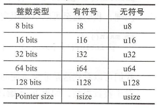
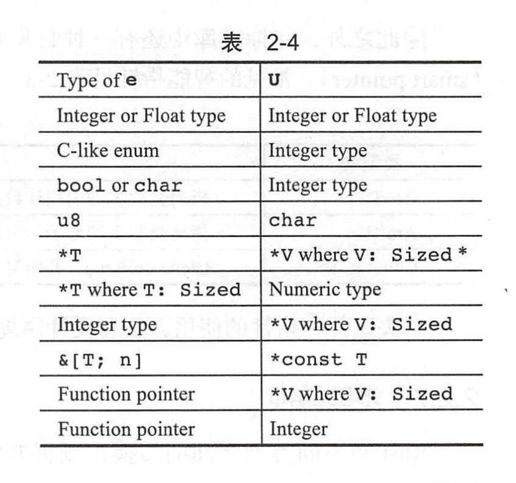
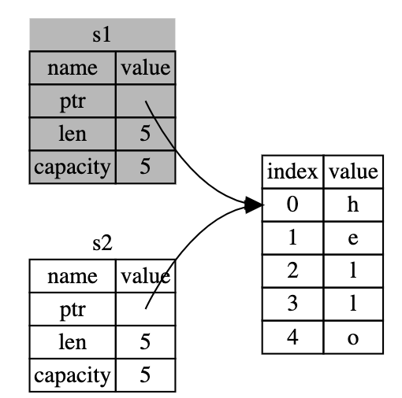
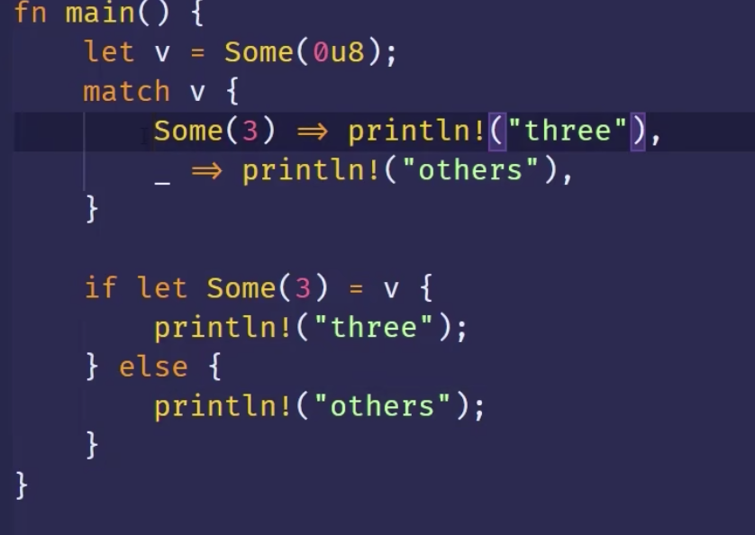
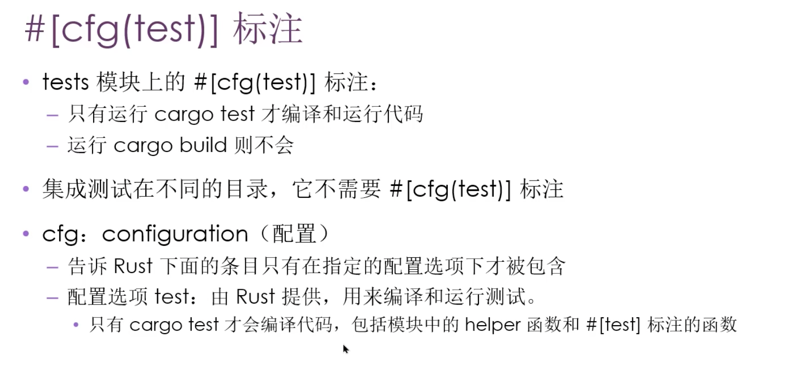
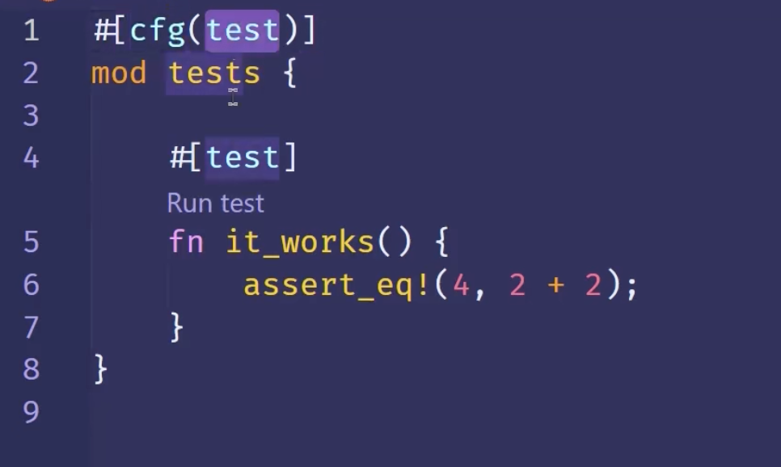

# cargo 

rust构建系统和包管理工具

cargo version 


// 创建项目
cargo new project_name

cargo build  
构建并运行 Cargo 项目

cargo run
运行文件

cargo publish
发布包


cargo 配置文件
[Title](Cargo.toml)


rust代码的包 称为库


## 变量

* 默认情况下`变量是不可变的`

```rust,editable
fn main() {
    let x = 5;  
    println!("The value of x is: {}", x);
    x = 6 // error 不可变的 不可以修改
}
```

### 可变量

* 变量名称前加mut

### 常量

* 与不可变变量类似，常量（constant）是绑定到一个常量名且不允许更改的值，但是常量和变量之间存在一些差异。

* 常量不允许使用 mut。常量不仅仅`默认不可变`，而且`自始至终不可变`。

* 使用 `const 关键字`而不是let关键字来声明，并且`值的类型必须注明`。

下面是一个常量声明的例子：
```rust
const THREE_HOURS_IN_SECONDS: u32 = 60 * 60 * 3;
```

### 遮蔽

你可以声明和前面变量具有相同名称的新变量。Rustacean 说这个是第一个变量被第二个变量遮蔽（shadow）.

```rust
fn main() {
    let x = 5;

    let x = x + 1;

    {
        let x = x * 2;
        println!("The value of x in the inner scope is: {}", x); // 12
    }

    println!("The value of x is: {}", x); // 6
}

```

mut和遮蔽区别？
因为我们在再次使用 let 关键字时有效地创建了一个新的变量，所以我们可以改变值的类型，但重复使用相同的名称。

```
    let spaces = "   ";
    let spaces = spaces.len(); // ok 遮蔽 可改变类型
```

```
    let mut spaces = "   ";
    spaces = spaces.len(); // error mut 类型不一致
```


## 数据类型

记住 Rust 是一种`静态类型`（statically typed）的语言，这意味着它必须在`编译期知道所有变量的类型`。
编译器通常可以`根据值`和使用方式`推导出我们想要使用的类型`。

### 整数



```rust
Length	Signed	Unsigned
8-bit	i8	u8
16-bit	i16	u16
32-bit	i32	u32
64-bit	i64	u64
128-bit	i128	u128
arch	isize	usize
```
i 前缀代表有符号，u 前缀代表无符号

 
### 浮点数
Rust 浮点数有分别为32位和64位的 f32 和 f64。默认类型是 f64。

```rust
    let x = 1.0; // f64
    let y: f32 = 2.0; // f32
```
浮点数符合 IEEE-754 规范。f32 是单精度浮点数，f64 是双精度浮点数。


### 布尔

Rust 支持 bool 类型，其值包括 true 和 false 两种。bool 类型占用1个字节。

```rust
    // boolean
    let flag = true;
    let flag : bool = false;
```


### 字符类型
char 类型，使用单引号定义。Rust 的 char 使用4个字节存储。

```rust
    let c = 'z';
    let z = 'ℤ';
    let heart_eyed_cat = '😻';
```


```rust
fn main() {

    // // let  a= 5;
    // let guess: i32  = "42a".parse().expect("Not a number!");
    // // println!(">>> a = {}", a);

    // println!(">>> {}", guess)

    let a = 5;
    let b:i32 = 5;

    // 十六进制	
    let c  = 0xff;

    // 浮点型
    let d = 2.0;
    let e:f32 = 2.0;
    let f:f64 = 2.0;

    let g = 5 + 10;

    // boolean
    let h = true;
    let i: bool = false; // with explicit type annotation

    let j = 'z';

    // 元组类型
    let tup: (i32, f64, u8) = (500, 6.4, 1);
    println!(">>> {}", tup.0); // 500
    println!(">>> {}", tup.1);// 6.4
    println!(">>> {}", tup.2); // 1
    let tup = (500, 6.4, 1);
    let (x, y, z) = tup;
    println!("The value of y is: {}", y);


    // 数组类型
    // 格式 [类型, 长度]
    let a = [1, 2, 3, 4, 5];

    let a: [i32; 5] = [1, 2, 3, 4, 5];
    a[0]; // 访问
}

```


### 枚举

1. 不带关联数据的枚举：
```rust,editable
enum State {
    Off,
    On,
}

fn main() {
    let light_state = State::On;
    match light_state {
        State::Off => println!("The light is off"),
        State::On => println!("The light is on"),
    }
}

```

2. 带关联数据的枚举：

```rust,editable
enum Option<T> {
    Some(T),
    None,
}

fn main() {
    let some_number = Some(42);
    match some_number {
        Some(number) => println!("The number is {}", number),
        None => println!("There is no number"),
    }
}
```

3. 带多个关联数据的枚举：

```rust,editable
enum Result<T, E> {
    Ok(T),
    Err(E),
}

fn main() {
    let result: Result<i32, &str> = Result::Ok(42);
    match result {
        Result::Ok(value) => println!("Result is Ok: {}", value),
        Result::Err(error) => println!("Result is Err: {}", error),
    }
}
```

4. 带结构体的枚举：

```rust,editable
enum Shape {
    Circle { radius: f64 },
    Rectangle { width: f64, height: f64 },
    Triangle { base: f64, height: f64 },
}

fn main() {
    let shape = Shape::Circle { radius: 5.0 };
    match shape {
        Shape::Circle { radius } => println!("Circle with radius: {}", radius),
        Shape::Rectangle { width, height } => println!("Rectangle with width: {}, height: {}", width, height),
        Shape::Triangle { base, height } => println!("Triangle with base: {}, height: {}", base, height),
    }
}

```

5. 带元组的枚举：

```rust,editable
enum Color {
    RGB(u8, u8, u8),
    CMYK(u8, u8, u8, u8),
}

fn main() {
    let color = Color::RGB(255, 0, 0);
    match color {
        Color::RGB(r, g, b) => println!("Red: {}, Green: {}, Blue: {}", r, g, b),
        Color::CMYK(c, m, y, k) => println!("Cyan: {}, Magenta: {}, Yellow: {}, Black: {}", c, m, y, k),
    }
}
```

6. 单元结构体的枚举：

```rust,editable
enum Direction {
    North,
    East,
    South,
    West,
}

fn main() {
    let dir = Direction::East;
    match dir {
        Direction::North => println!("Facing North"),
        Direction::East => println!("Facing East"),
        Direction::South => println!("Facing South"),
        Direction::West => println!("Facing West"),
    }
}
```


### 复合类型

### 类型推断

Rust 类型推导功能是比较强大的 它不仅可以从变量声明的当前语句中获取信息进行
推导，而且还能通过上下文信息进行推导


```rust
fn main() {
    // 可推断出 v是i32类型
    let v = 1;


    // 创建一个动态数组 数组内包含的是什 素类 型可以不写
    let mut vec = Vec::new(); 
    vec .push(elem); 
    // 后面调用了 pu sh 函数 通过 ele 变量的类型
    // 编译器可以推导出 vec 的实 际类型是 Vec<u8>
    println! ("{:?}", vec);
}

```

### 类型别名

我们可以用 type 键字给同一个类型起个别名（type lias 示例如下：

`type Age = u32; `
```rust
fn grow(age: Age, year: u32) - > Age { 
    age + year 
}
fn main() { 
    let x:Age = 20; 
    println!(" 20 years later :{}", grow(x, 20))
}; 
```
类型 还可以用在泛型景， 比如：

type Double<T> = (T, Vec<T>); // 小括号包围的是一个 tuple请参见后文中的复合数据类型

那么以使用`Double<i32＞`的时候， `(i32, vec<i32＞)` ，可以简 代码


### 静态变量

Rust 中可以用`static关键字`声明静态变量。如下所示

`static GLOBAL: i32 = 0; `

与let语句一样， static语句同样也是一个模式匹配。与let语句不同的是，用static声明变量的生命周期是整个程序，从启动到退出 static 的生命周期永远static ，它`占用的内存空间也不会在执行过程中回收`。 这也是 rust中唯一的声明全局的方法。

* 语法

static 变量的声明语法如下所示：

`static NAME: TYPE = VALUE;`

    * `NAME` 是静态变量的名称。
    * `TYPE` 是静态变量的类型。
    * `VALUE` 是静态变量的初始值。


* 特点
    * 全局变量必须声明的时候初始化。 因为全局变量可以写到函数外面，被任意一个函数使用。
    * 可变全局变量无论读写都必须用unsafe修饰。
        ```rust
        static mut MUTABLE_COUNT: i32 = 10;

        fn main() {
            unsafe {
                println!("The value of MUTABLE_COUNT is: {}", MUTABLE_COUNT);
                MUTABLE_COUNT = 20;
                println!("Now the value of MUTABLE_COUNT is: {}", MUTABLE_COUNT);
            }
        }
        ```

### 类型转换

Rust设计者希望在发生类型转换的时候不是偷偷摸摸进行的，而是显式地标记出来，防止隐藏的bug。虽然在许多时候会让代码显得不那么精简，但这也算是一种合理的折中。

`as关键字`也不是随便可以用的，它只允许编译器认为合理的类型转换.任意类型转换是不允许的.

```rust
let a =”some string"; 
l et b = a as u32; ／／ 编译错误
```



```rust
fn main() {
    let var1:i8 = 41;
    // let var2: i16 = var1; // error
    // let var2: i16 = var1.into();
    let var2: i16 = var1 as i16;
    println!("{}", var2);
}
```

### 函数

```rust
fn main() {
    println!("Hello, world!");

    another_function();
}

fn another_function() {
    println!("Another function.");
}


// 函数可以向调用它的代码返回值。
// 使用 return 关键字和指定值，可以从函数中提前返回；但大部分函数隐式返回最后一个表达式。这是一个有返回值函数的例子：
fn five() -> i32 {
    5 // 表达式相当于是一个语句
}

fn main() {
    let x = five();

    println!("The value of x is: {}", x);
```

* 返回值相关的
```rust
// 定义一个返回类型为 `Option<i32>` 的函数
fn get_value(input: i32) -> Option<i32> {
    if input >= 0 {
        Some(input * 2) // 如果输入大于等于 0，返回一个有值的 Some(input * 2)
    } else {
        None // 如果输入小于 0，返回一个空的 None
    }
}

fn main() {
    let result1: Option<i32> = None;    // 创建一个 Option<i32> 类型的空值
    match result1 { 
        Some(value) => println!("Result 1 is Some: {}", value), // 如果结果为 Some，则打印值
        None => println!("Result 1 is None"), // 如果结果为 None，则表示空值
    }

    let result2 = get_value(3);
    match result2 {
        Some(value) => println!("Result 2 is Some: {}", value),
        None => println!("Result 2 is None"),
    }
}


// https://www.yuque.com/aichihongdouheyumi/blog/bbzd4a#gC4YL
```


## if判断语句

```js
fn main() {
    let number = 3;
    // if后面必须是boolean
    if number < 5 {
        println!("condition was true");
    } else { // else也可以省略
        println!("condition was false");
    }

 
}
```

* if的复值
这种用法的时候，if，else的返回类型必须相同
```rust
fn main() {
    let condition = true;

    let number = if condition { 5 } else { 6 };

    println!("The value of number is: {}", number);
}

```

# 循环


Rust 有三种循环：loop、while 和 for。我们每一个都试试。


## loop

重复执行代码

```rust
fn main() {
    loop {
        println!("again!");
    }
}
```

也可结合break，continue一起使用。
```rust
fn main() {
    let mut count = 0;
    'counting_up: loop {
        println!("count = {}", count);
        let mut remaining = 10;

        loop {
            println!("remaining = {}", remaining);
            if remaining == 9 {
                break;
            }
            if count == 2 {
                break 'counting_up;
            }
            remaining -= 1;
        }

        count += 1;
    }
    println!("End count = {}", count);
}

```

也可返回

```rust
fn main() {
    let mut counter = 0;

    let result = loop {
        counter += 1;

        if counter == 10 {
            break counter * 2;
        }
    };

    println!("The result is {}", result);
}
```

## while循环

```rust
fn main() {
    let mut number = 3;

    while number != 0 {
        println!("{}!", number);

        number -= 1;
    }

    println!("LIFTOFF!!!");
}
```

## for-in

```rust
fn main() {
    let a = [10, 20, 30, 40, 50];

    for element in a {
        println!("the value is: {}", element);
    }
}

```


## ..语法

在 Rust 中，0..N 是一个 range（范围）表达式，表示从 0 开始、但不包括 N 的一个区间。这个区间包含从 0 到 N-1 的所有整数。

例如，0..5 表示一个从 0 开始、但不包括 5 的整数区间，即包含 0, 1, 2, 3, 4 这五个整数。

这种区间通常用于迭代或者进行类似迭代的操作。可以通过 for 循环来遍历这个区间中的元素，也可以通过迭代器方法进行处理。


```rust,editable
fn main() {
    // 使用 for 循环遍历区间中的元素
    for i in 0..5 {
        println!("{}", i); // 输出 0, 1, 2, 3, 4
    }

    // 使用迭代器方法处理区间中的元素
    let range = 0..5;
    let doubled: Vec<_> = range.map(|x| x * 2).collect();
    println!("{:?}", doubled); // 输出 [0, 2, 4, 6, 8]
}

```


# 所有权

## `移动`

为了确保内存安全，这种场景下 Rust 的处理有另一个细节值得注意。在`let s2 = s1` 之后，Rust 认为 `s1 不再有效`，因此 Rust 不需要在 s1 离开作用域后清理任何东西。看看在 s2 被创建之后尝试使用 s1 会发生什么；这段代码不能运行：

```rust
    let s1 = String::from("hello");
    let s2 = s1;

    println!("{}, world!", s1);

```




在 Rust 中，一些基本的固定大小类型（Primitive Type）实现了 Copy trait，因此它们在进行赋值操作时会进行复制（浅拷贝），而不会发生所有权的转移。这些类型通常包括：

* 所有的整数类型（i32、u32、i64、u64 等）
* 布尔类型 (bool)
* 浮点数类型 (f32、f64)
* 字符类型 (char)
* 元组，当且仅当其包含的类型也都实现 Copy 的时候。比如，(i32, i32) 实现了 Copy，但 (i32, String) 就没有。
这些类型都具有固定的大小且简单，因此赋值时会进行内存的复制，而不是移动。在赋值操作后，原始变量依然有效，它们的所有权不会转移到新的变量。

其他像 String、Vec、struct 等复杂类型通常不实现 Copy trait，因为它们的大小在编译时是未知的或者是动态分配的。这些类型的赋值操作会导致所有权的转移，因为它们需要在堆上分配内存，并且移动所有权避免了资源重复释放或不确定性的问题。

需要特别注意的是，自定义的结构体或枚举类型，默认情况下也不会实现 Copy trait。如果想要让自定义的类型具备 Copy 特性，必须满足以下条件：

所有字段的类型都实现了 Copy trait；
该类型没有实现自定义的 Drop trait。
因为 Drop trait 用于指定在值离开作用域时执行的清理操作，而实现了 Drop trait 的类型将不会自动实现 Copy trait。所以要实现 Copy trait，确保类型不包含任何需要特殊清理的资源。


当变量类型实现了 Copy trait 时，赋值操作并不会导致所有权的转移，而是进行了一份浅拷贝，原始变量仍然有效。

以下是一个示例，展示了实现了 Copy trait 的 i32 类型进行赋值操作的情况：

```rust
fn main() {
    let x = 5; // i32 类型，实现了 Copy trait
    let y = x; // 这里是复制，不是转移所有权

    println!("x: {}", x); // x 依然有效
    println!("y: {}", y); // 打印 y 的值
}
```
`是像整型这样的在编译时已知大小的类型被整个存储在栈上，所以拷贝其实际的值是快速的。`

在这个示例中，i32 类型的变量 x 包含整数值 5，而 let y = x; 这行代码并没有导致 x 的所有权转移到 y，而是进行了一份复制，所以 x 依然有效。因为 i32 类型实现了 Copy trait，赋值操作只是进行了值的复制，原始变量并没有失效。这使得 x 和 y 都拥有自己的内存空间，互不影响。


`函数`

```rust,editable
fn main() {
  let s = String::from("hello");  // s 进入作用域

  takes_ownership(s);             // s 的值移动到函数里 ...
  println!("{}", s);    // ... 所以到这里不再有效

  let x = 5;                      // x 进入作用域

  makes_copy(x);                  // x 应该移动函数里，
                                  // 但 i32 是 Copy 的，所以在后面可继续使用 x

} // 这里, x 先移出了作用域，然后是 s。但因为 s 的值已被移走，
  // 所以不会有特殊操作

fn takes_ownership(some_string: String) { // some_string 进入作用域
  println!("{}", some_string);
} // 这里，some_string 移出作用域并调用 `drop` 方法。占用的内存被释放

fn makes_copy(some_integer: i32) { // some_integer 进入作用域
  println!("{}", some_integer);
} // 这里，some_integer 移出作用域。不会有特殊操作

```

## 克隆

1. `定义`

在 Rust 中，Clone 是一个 trait，用于定义类型的克隆行为。它包含一个方法 clone，该方法负责创建当前类型的一个副本。

rust
Copy code
pub trait Clone {
    fn clone(&self) -> Self;
}
上述代码片段是 Clone trait 的基本定义。任何希望支持克隆操作的类型都必须实现这个 trait。

2. `特点`

`创建副本` (Creating Copies): 克隆操作会创建当前值的一个新实例，使得新实例与原始实例相等但拥有独立的内存。

`实现方式自定义` (Customizable Implementation): 类型的开发者可以根据其特定需求来自定义 Clone trait 的实现方式。这允许开发者精确控制如何进行克隆，特别是对于涉及到所有权、生命周期和资源管理的复杂类型。


3. `支持类型`

3.1 **基本类型 (Primitive Types):**
- 整数类型 (**i32**, **u64**, 等)
- 浮点数类型 (**f32**, **f64**)
- 布尔类型 (**bool**)
- 字符类型 (**char**)

```rust
let original_int = 42;
let cloned_int = original_int.clone();
```

3.2 **字符串类型 (String Types):**
- **String**
- **&str**

```rust
let original_str = String::from("Hello, World!");
let cloned_str = original_str.clone();
```

3.3 **集合类型 (Collection Types):**
- **Vec<T>**
- **HashMap<K, V>**
- **BTreeMap<K, V>**
- **HashSet<T>**
- **BTreeSet<T>**

```rust
let original_vec = vec![1, 2, 3];
let cloned_vec = original_vec.clone();
```

```rust
use std::collections::HashMap;

let original_map: HashMap<&str, i32> = [("one", 1), ("two", 2)].iter().cloned().collect();
let cloned_map = original_map.clone();
```

3.4 **元组 (Tuples):**

```rust
let original_tuple = (1, "hello", 3.14);
let cloned_tuple = original_tuple.clone();
```

3.5 **结构体 (Structs) 和 枚举 (Enums):**
- 用户自定义的结构体和枚举可以通过 **derive(Clone)** 来实现 **Clone** trait。


# 结构体


```
struct User {
    active: bool,
    username: String,
    email: String,
    sign_in_count: u64,
}
```

`使用`

```
fn main() {
    let user1 = User {
        email: String::from("someone@example.com"),
        username: String::from("someusername123"),
        active: true,
        sign_in_count: 1,
    };
}


也可简写

fn build_user(email: String, username: String) -> User {
    User {
        email,
        username,
        active: true,
        sign_in_count: 1,
    }
}


也可用...语法

fn main() {
    // --snip--

    let user2 = User {
        email: String::from("another@example.com"),
        ..user1
    };
}
```

`打印结构体:`

```rust

#[derive(Debug)]
struct Rectangle {
    width: u32,
    height: u32,
}

fn main() {
    let scale = 2;
    let rect1 = Rectangle {
        width: dbg!(30 * scale), // 会输出[src/main.rs:16] 30 * scale = 60
        height: 50,
    };

    println!("rect1 is {:?}", rect1);
}

```

`定义方法`
```rust
#[derive(Debug)]
struct Rectangle {
    width: u32,
    height: u32,
}

impl Rectangle {
    fn area(&self) -> u32 {
        self.width * self.height
    }
}

fn main() {
    let rect1 = Rectangle {
        width: 30,
        height: 50,
    };

    println!(
        "The area of the rectangle is {} square pixels.",
        rect1.area()
    );
}

```

# 枚举

- Rust 中的枚举（enumerations）是一种自定义数据类型，用于表示一个值可以是有限集合中的一种情况。枚举在 Rust 中非常强大，可以用于模式匹配、错误处理、状态管理等多种情境。下面是 Rust 中枚举的全面介绍： 
1. **定义枚举** ：

使用 `enum` 关键字来定义一个枚举类型。枚举可以包含多个变体（variants），每个变体代表一个可能的值。例如：

```rust
enum IpAddrKind {
    V4,
    V6,
}
```


这里定义了一个名为 `IpAddrKind` 的枚举，它有两个变体 `V4` 和 `V6`，分别表示 IPv4 和 IPv6 地址类型。 
2. **创建枚举值** ：

你可以使用枚举变体来创建枚举值。例如：

```rust
let ipv4 = IpAddrKind::V4;
let ipv6 = IpAddrKind::V6;
``` 
3. **匹配枚举值** ：

使用 `match` 表达式可以匹配枚举值，执行不同的代码分支，根据枚举值的变体来执行相应的操作。例如：

```rust
enum IpAddr {
    V4(String),
    V6(u32, u32, u32, u32),
}

match ipv4 {
    IpAddrKind::V4 => println!("This is an IPv4 address."),
    IpAddrKind::V6 => println!("This is an IPv6 address."),
}
``` 
4. **枚举可以携带数据** ：

枚举的变体可以携带数据，这使得它们非常灵活。数据可以是不同的类型，如整数、字符串、结构体等。例如：

```rust
enum IpAddr {
    V4(String),
    V6(u32, u32, u32, u32),
}
```


这里定义了一个新的枚举 `IpAddr`，其中 `V4` 变体携带一个字符串，而 `V6` 变体携带四个 32 位整数。 
5. **枚举的模式匹配** ：

使用 `match` 表达式来模式匹配携带数据的枚举值：

```rust
enum IpAddr {
    V4(String),
    V6(u32, u32, u32, u32),
}

fn main() {
    let v4 = IpAddr::V4(String::from("127.0.0.1"));
    let v6 = IpAddr::V6(1, 2, 3, 4);

    ipfun(v4);
    ipfun(v6);
}

fn ipfun(home: IpAddr) {
    match home {
        IpAddr::V4(ip) => println!("IPv4 address: {}", ip),
        IpAddr::V6(a, b, c, d) => println!("IPv6 address: {}.{}.{}.{}", a, b, c, d),
    }
}


``` 
6. **Option 枚举** ：

`Option` 枚举是 Rust 标准库中的一个常见枚举，用于表示可能存在或不存在的值。它有两个变体 `Some` 和 `None`，通常用于处理可能的空值情况。

```rust
enum Option<T> {
    Some(T),
    None,
}
```


例如，`Option` 可以用于安全地处理可能返回空值的操作，如文件读取或数据解析。 

7. **Result 枚举** ：

`Result` 枚举也是 Rust 标准库中的常见枚举，用于表示操作的结果，可能是成功的 `Ok` 或失败的 `Err`。通常用于处理错误和异常情况。

```rust
enum Result<T, E> {
    Ok(T),
    Err(E),
}
```


例如，`Result` 可以用于处理文件读取、网络请求、错误处理等操作。 
8. **枚举的衍生 trait** ：

你可以为枚举类型实现各种 Rust 标准 trait，如 `Debug`、`Clone`、`Eq` 等，以便进行调试、克隆和其他操作。这可以通过 `#[derive]` 属性来简化。

```rust
#[derive(Debug, Clone, PartialEq, Eq)]
enum MyEnum {
    // ...
}
```

枚举是 Rust 中的强大工具，用于建模各种可能的情况和状态。它们提供了模式匹配、错误处理和更好的类型安全性，使得 Rust 成为一种适合编写安全且高效代码的语言。


# Option

* Some(T)

```rust
enum Option<T> {
    Some(T),  // 表示值存在并携带该值
    None,     // 表示值不存在
}
```
* Some 包裹了一个具体的值 T，表示值存在。
* None 表示值不存在。


```rust
fn main() {
    // 使用 `Some` 表示值存在
    let some_value: Option<i32> = Some(42);

    // 使用 `None` 表示值不存在
    let none_value: Option<i32> = None;

    match some_value { // Value exists: 42
        Some(value) => println!("Value exists: {}", value),
        None => println!("Value doesn't exist."),
    }

    match none_value { //  Value doesn't exist.
        Some(value) => println!("Value exists: {}", value),
        None => println!("Value doesn't exist."),
    }
}

```

# if-else



#  package, crate, module
Package（包）：

Package 是一个包含 Cargo.toml 文件的目录，它定义了一个 Rust 项目。一个包可以包含一个或多个 crates。
一个包可能由多个 crates 组成，例如一个二进制可执行程序和它所依赖的库可以分别是不同的 crates。

Crate（箱）：

Crate 是 Rust 中最小的代码单元，可以编译为一个二进制文件或者库。
一个 crate 可以是一个库（library crate）用于提供功能的模块集合，也可以是一个二进制 crate（binary crate）用于生成可执行文件。
Crate 在文件系统中通常对应于一个目录，包含一个 Cargo.toml 文件以及源代码文件。

Module（模块）：

Module 是 Rust 语言中用于组织代码的单元，可以帮助将代码分割成较小的、可管理的部分。
使用 mod 关键字来创建模块，可以将相关联的函数、结构体、枚举等项组织在一起。
模块可以嵌套，形成层次结构，使得代码更具有结构性和可读性。
Rust 中的模块系统使用 mod 和 use 关键字来进行模块的声明和导入。

总结来说：

Package 是一个整个 Rust 项目，可以包含多个 crates。
Crate 是 Rust 中的最小编译单元，可以是库（library crate）或二进制（binary crate）。
Module 是组织代码的单元，可以帮助你将代码模块化并提高代码的结构性和可维护性。
这些概念共同帮助着 Rust 程序员组织和管理他们的代码，使得代码更加模块化、易于维护和扩展。


# 单元测试







# 闭包

<!--  -->

1. 匿名性
函数：具有显式名称，通过 fn 关键字定义。
闭包：是匿名的，没有显式的名称，使用 |..| { .. } 语法定义。
2. 环境捕获
函数：无法捕获其定义位置之外的变量。
闭包：能够捕获其定义位置外的变量。闭包可以捕获其周围环境中的变量，并在闭包内部使用，包括通过引用、可变引用或所有权的方式。
3. 可移动性和所有权
函数：不具有所有权的概念，因此不涉及所有权转移。
闭包：能够获取其所需要的变量的所有权或可变引用，具有对其环境的所有权或可变性。
4. 定义方式
函数：通过 fn 关键字定义，有显式名称。
闭包：使用 |..| { .. } 语法定义，通常以匿名方式使用。
5. 类型推导
函数：需要显式地声明参数和返回值类型。
闭包：Rust 编译器通常能够推断闭包的参数和返回值类型，因此可以在大多数情况下省略类型声明。
6. 生命周期和调用方式
函数：在定义后可以直接调用，不需要再次声明或赋值。
闭包：通常是在定义后立即调用，也可以存储在变量中供稍后调用。
7. Capture 类型
函数：不涉及环境捕获。
闭包：具有不同的 Capture 类型，FnOnce、FnMut 和 Fn，分别表示捕获所有权、可变引用和不可变引用。


在 Rust 中，闭包可以捕获其环境中的变量。这个特性使得闭包在定义时可以访问外部作用域的变量，这些变量可以通过三种不同的方式进行捕获，即 FnOnce、FnMut 和 Fn。

1. FnOnce：捕获所有权

当闭包需要获取其周围环境中的变量所有权时，使用 FnOnce 类型的闭包。这意味着闭包在调用后会获取环境中变量的所有权，因此只能调用一次。

示例：

rust
Copy code
fn main() {
    let data = vec![1, 2, 3];

    let closure = move || {
        println!("{:?}", data); // 这里闭包捕获了 data 的所有权
    };

    closure(); // 调用闭包
    // closure(); // 这里尝试再次调用闭包会导致编译错误，因为闭包已经捕获了所有权
}
在上述示例中，闭包 closure 捕获了 data 的所有权。在调用闭包后，data 的所有权转移给了闭包，因此尝试再次调用闭包会导致所有权已移动的编译错误。

2. FnMut：捕获可变引用

当闭包需要修改其周围环境中的变量时，但不需要获取所有权时，使用 FnMut 类型的闭包。这允许闭包获取可变引用，并在闭包内部修改变量。

示例：

rust
Copy code
fn main() {
    let mut counter = 0;

    let mut closure = || {
        counter += 1; // 在闭包中修改 counter 变量
        println!("{}", counter);
    };

    closure(); // 调用闭包，输出：1
    closure(); // 再次调用闭包，输出：2
}
在上述示例中，闭包 closure 通过 mut 关键字标记为可变的，并修改了其周围环境中的 counter 变量。每次调用闭包时，counter 都会递增。

3. Fn：捕获不可变引用

当闭包需要访问其周围环境中的变量但不需要修改它时，使用 Fn 类型的闭包。这允许闭包获取不可变引用，并在闭包内部访问变量。

示例：

```
fn main() {
    let data = vec![1, 2, 3];

    let closure = || {
        println!("{:?}", data); // 在闭包中访问 data 变量的不可变引用
    };

    closure(); // 调用闭包
}
```
在上述示例中，闭包 closure 捕获了 data 变量的不可变引用，允许在闭包中访问数据，但不允许修改它。


```rust

#![allow(unused_variables)]
fn main() {
struct Cacher<T>
    where T: Fn(u32) -> u32
{
    calculation: T,
    value: Option<u32>,
}

impl<T> Cacher<T>
    where T: Fn(u32) -> u32
{
    fn new(calculation: T) -> Cacher<T> {
        Cacher {
            calculation,
            value: None,
        }
    }

    fn value(&mut self, arg: u32) -> u32 {
        match self.value {
            Some(v) => v,
            None => {
                let v = (self.calculation)(arg);
                self.value = Some(v);
                v
            },
        }
    }
}
}

```


# 宏


## 声明宏


# 生命周期
* Rust 中的每一个引用都有其 生命周期（lifetime），也就是引用保持有效的作用域。


```rust
fn main() {
    {
        let r;
        {
            let x = 5;
            r = &x; //     ^^ borrowed value does not live long enough
        } // 这里x的生命周期已结束
        println!("r: {}", r);
    }
}
```

* 借用检查器

```rust
{
    let r;                // ---------+-- 'a
                          //          |
    {                     //          |
        let x = 5;        // -+-- 'b  |
        r = &x;           //  |       |
    }                     // -+       |
                          //          |
    println!("r: {}", r); //          |
}                         // ---------+

```

生命周期最小的那个 

* 第一条规则是每一个是引用的参数都有它自己的生命周期参数。换句话说就是，有一个引用参数的函数有一个生命周期参数：fn foo<'a>(x: &'a i32)，有两个引用参数的函数有两个不同的生命周期参数，fn foo<'a, 'b>(x: &'a i32, y: &'b i32)，依此类推。

* 第二条规则是如果只有一个输入生命周期参数，那么它被赋予所有输出生命周期参数：fn foo<'a>(x: &'a i32) -> &'a i32。

* 第三条规则是如果方法有多个输入生命周期参数并且其中一个参数是 &self 或 &mut self，说明是个对象的方法(method)(译者注： 这里涉及 Rust 的面向对象，参见第 17 章), 那么所有输出生命周期参数被赋予 self 的生命周期。第三条规则使得方法更容易读写，因为只需更少的符号。


# rust中文手册
https://rustwiki.org/zh-CN/reference/attributes.html

https://github.com/i5ting/learn-rust-for-fe 学习工具

https://github1s.com/TonyCrane/note/tree/af3095d2af2e772ef30f510a9ef621154814b6d5

https://www.cnblogs.com/praying/p/14457360.html

https://foresightnews.pro/article/detail/11721
