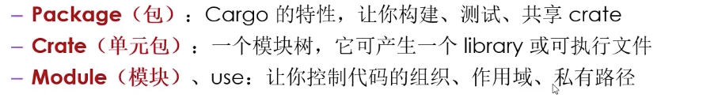

# cargo 

rust构建系统和包管理工具

cargo version 


// 创建项目
cargo new project_name

cargo build  
构建并运行 Cargo 项目

cargo run
运行文件

cargo publish
发布包


cargo 配置文件
[Title](Cargo.toml)


rust代码的包 称为库


## 变量

* 默认情况下`变量是不可变的`

```rust
fn main() {
    let x = 5;  
    println!("The value of x is: {}", x);
    x = 6
}
```

### 常量

* 与不可变变量类似，常量（constant）是绑定到一个常量名且不允许更改的值，但是常量和变量之间存在一些差异。

* 常量不允许使用 mut。常量不仅仅`默认不可变`，而且`自始至终不可变`。

* 使用 `const 关键字`而不是let关键字来声明，并且`值的类型必须注明`。

下面是一个常量声明的例子：
```rust
const THREE_HOURS_IN_SECONDS: u32 = 60 * 60 * 3;
```

### 遮蔽

你可以声明和前面变量具有相同名称的新变量。Rustacean 说这个是第一个变量被第二个变量遮蔽（shadow）.

```rust
fn main() {
    let x = 5;

    let x = x + 1;

    {
        let x = x * 2;
        println!("The value of x in the inner scope is: {}", x); // 12
    }

    println!("The value of x is: {}", x); // 6
}

```

mut和遮蔽区别？
因为我们在再次使用 let 关键字时有效地创建了一个新的变量，所以我们可以改变值的类型，但重复使用相同的名称。

```
    let spaces = "   ";
    let spaces = spaces.len(); // ok 遮蔽 可改变类型
```

```
    let mut spaces = "   ";
    spaces = spaces.len(); // error mut 类型不一致
```


## 数据类型

记住 Rust 是一种`静态类型`（statically typed）的语言，这意味着它必须在`编译期知道所有变量的类型`。
编译器通常可以`根据值`和使用方式`推导出我们想要使用的类型`。

```rust
fn main() {

    // // let  a= 5;
    // let guess: i32  = "42a".parse().expect("Not a number!");
    // // println!(">>> a = {}", a);

    // println!(">>> {}", guess)

    let a = 5;
    let b:i32 = 5;

    // 十六进制	
    let c  = 0xff;

    // 浮点型
    let d = 2.0;
    let e:f32 = 2.0;
    let f:f64 = 2.0;

    let g = 5 + 10;

    // boolean
    let h = true;
    let i: bool = false; // with explicit type annotation

    let j = 'z';

    // 元组类型
    let tup: (i32, f64, u8) = (500, 6.4, 1);
    println!(">>> {}", tup.0); // 500
    println!(">>> {}", tup.1);// 6.4
    println!(">>> {}", tup.2); // 1
    let tup = (500, 6.4, 1);
    let (x, y, z) = tup;
    println!("The value of y is: {}", y);


    // 数组类型
    // 格式 [类型, 长度]
    let a = [1, 2, 3, 4, 5];

    let a: [i32; 5] = [1, 2, 3, 4, 5];
    a[0]; // 访问
}

```

### 函数

```rust
fn main() {
    println!("Hello, world!");

    another_function();
}

fn another_function() {
    println!("Another function.");
}


// 函数可以向调用它的代码返回值。
// 使用 return 关键字和指定值，可以从函数中提前返回；但大部分函数隐式返回最后一个表达式。这是一个有返回值函数的例子：
fn five() -> i32 {
    5 // 表达式相当于是一个语句
}

fn main() {
    let x = five();

    println!("The value of x is: {}", x);
```


## 判断语句

```js
fn main() {
    let number = 3;
    // if后面必须是boolean
    if number < 5 {
        println!("condition was true");
    } else {
        println!("condition was false");
    }

    let number = if condition { 5 } else { 6 };

}

```


# 结构体

`定义`

```
struct User {
    active: bool,
    username: String,
    email: String,
    sign_in_count: u64,
}
```

`使用`

```
fn main() {
    let user1 = User {
        email: String::from("someone@example.com"),
        username: String::from("someusername123"),
        active: true,
        sign_in_count: 1,
    };
}


也可简写

fn build_user(email: String, username: String) -> User {
    User {
        email,
        username,
        active: true,
        sign_in_count: 1,
    }
}


也可用...语法

fn main() {
    // --snip--

    let user2 = User {
        email: String::from("another@example.com"),
        ..user1
    };
}
```

`打印结构体:`

```rust

#[derive(Debug)]
struct Rectangle {
    width: u32,
    height: u32,
}

fn main() {
    let scale = 2;
    let rect1 = Rectangle {
        width: dbg!(30 * scale), // 会输出[src/main.rs:16] 30 * scale = 60
        height: 50,
    };

    println!("rect1 is {:?}", rect1);
}

```

`定义方法`
```rust
#[derive(Debug)]
struct Rectangle {
    width: u32,
    height: u32,
}

impl Rectangle {
    fn area(&self) -> u32 {
        self.width * self.height
    }
}

fn main() {
    let rect1 = Rectangle {
        width: 30,
        height: 50,
    };

    println!(
        "The area of the rectangle is {} square pixels.",
        rect1.area()
    );
}

```

# 枚举

- Rust 中的枚举（enumerations）是一种自定义数据类型，用于表示一个值可以是有限集合中的一种情况。枚举在 Rust 中非常强大，可以用于模式匹配、错误处理、状态管理等多种情境。下面是 Rust 中枚举的全面介绍： 
1. **定义枚举** ：

使用 `enum` 关键字来定义一个枚举类型。枚举可以包含多个变体（variants），每个变体代表一个可能的值。例如：

```rust
enum IpAddrKind {
    V4,
    V6,
}
```


这里定义了一个名为 `IpAddrKind` 的枚举，它有两个变体 `V4` 和 `V6`，分别表示 IPv4 和 IPv6 地址类型。 
2. **创建枚举值** ：

你可以使用枚举变体来创建枚举值。例如：

```rust
let ipv4 = IpAddrKind::V4;
let ipv6 = IpAddrKind::V6;
``` 
3. **匹配枚举值** ：

使用 `match` 表达式可以匹配枚举值，执行不同的代码分支，根据枚举值的变体来执行相应的操作。例如：

```rust
enum IpAddr {
    V4(String),
    V6(u32, u32, u32, u32),
}

match ipv4 {
    IpAddrKind::V4 => println!("This is an IPv4 address."),
    IpAddrKind::V6 => println!("This is an IPv6 address."),
}
``` 
4. **枚举可以携带数据** ：

枚举的变体可以携带数据，这使得它们非常灵活。数据可以是不同的类型，如整数、字符串、结构体等。例如：

```rust
enum IpAddr {
    V4(String),
    V6(u32, u32, u32, u32),
}
```


这里定义了一个新的枚举 `IpAddr`，其中 `V4` 变体携带一个字符串，而 `V6` 变体携带四个 32 位整数。 
5. **枚举的模式匹配** ：

使用 `match` 表达式来模式匹配携带数据的枚举值：

```rust
enum IpAddr {
    V4(String),
    V6(u32, u32, u32, u32),
}

fn main() {
    let v4 = IpAddr::V4(String::from("127.0.0.1"));
    let v6 = IpAddr::V6(1, 2, 3, 4);

    ipfun(v4);
    ipfun(v6);
}

fn ipfun(home: IpAddr) {
    match home {
        IpAddr::V4(ip) => println!("IPv4 address: {}", ip),
        IpAddr::V6(a, b, c, d) => println!("IPv6 address: {}.{}.{}.{}", a, b, c, d),
    }
}


``` 
6. **Option 枚举** ：

`Option` 枚举是 Rust 标准库中的一个常见枚举，用于表示可能存在或不存在的值。它有两个变体 `Some` 和 `None`，通常用于处理可能的空值情况。

```rust
enum Option<T> {
    Some(T),
    None,
}
```


例如，`Option` 可以用于安全地处理可能返回空值的操作，如文件读取或数据解析。 

7. **Result 枚举** ：

`Result` 枚举也是 Rust 标准库中的常见枚举，用于表示操作的结果，可能是成功的 `Ok` 或失败的 `Err`。通常用于处理错误和异常情况。

```rust
enum Result<T, E> {
    Ok(T),
    Err(E),
}
```


例如，`Result` 可以用于处理文件读取、网络请求、错误处理等操作。 
8. **枚举的衍生 trait** ：

你可以为枚举类型实现各种 Rust 标准 trait，如 `Debug`、`Clone`、`Eq` 等，以便进行调试、克隆和其他操作。这可以通过 `#[derive]` 属性来简化。

```rust
#[derive(Debug, Clone, PartialEq, Eq)]
enum MyEnum {
    // ...
}
```

枚举是 Rust 中的强大工具，用于建模各种可能的情况和状态。它们提供了模式匹配、错误处理和更好的类型安全性，使得 Rust 成为一种适合编写安全且高效代码的语言。


# Option

* Some(T)

```rust
enum Option<T> {
    Some(T),  // 表示值存在并携带该值
    None,     // 表示值不存在
}
```
* Some 包裹了一个具体的值 T，表示值存在。
* None 表示值不存在。


```rust
fn main() {
    // 使用 `Some` 表示值存在
    let some_value: Option<i32> = Some(42);

    // 使用 `None` 表示值不存在
    let none_value: Option<i32> = None;

    match some_value { // Value exists: 42
        Some(value) => println!("Value exists: {}", value),
        None => println!("Value doesn't exist."),
    }

    match none_value { //  Value doesn't exist.
        Some(value) => println!("Value exists: {}", value),
        None => println!("Value doesn't exist."),
    }
}

```

#  package, crate, module

package(包) - 
crate(单元包) - 



# rust中文手册
https://rustwiki.org/zh-CN/reference/attributes.html

https://github.com/i5ting/learn-rust-for-fe 学习工具

https://github1s.com/TonyCrane/note/tree/af3095d2af2e772ef30f510a9ef621154814b6d5

https://www.cnblogs.com/praying/p/14457360.html

https://foresightnews.pro/article/detail/11721